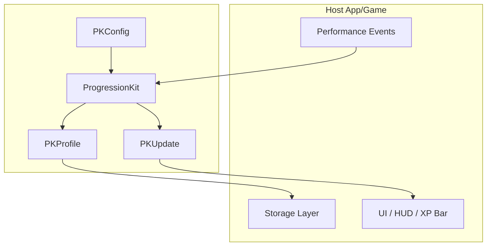

<p align="center">
  <a href="https://developer.apple.com/swift/"></a>
  <a href="https://developer.apple.com/xcode/"></a>
  <a href="https://developer.apple.com/documentation/xcode/swift-packages"></a>
  <a href="https://en.wikipedia.org/wiki/List_of_Apple_operating_systems"></a>
  <a href="https://thatfactory.github.io/progressionkit/documentation/progressionkit/"></a>
  <a href="https://en.wikipedia.org/wiki/MIT_License"></a>
  <a href="https://github.com/thatfactory/progressionkit/actions/workflows/ci.yml"></a>
  <a href="https://github.com/thatfactory/progressionkit/actions/workflows/release.yml"></a>
</p>

# ProgressionKit
A reusable progression engine that turns player performance into configurable XP, levels, and unlocks across games and apps. 📈

`ProgressionKit` is a pure Swift package for apps and games that need deterministic progression logic without coupling progression rules to storage or UI frameworks.

It models:

- `XP` gain from successful performance.
- Player levels derived from total XP.
- Track-scoped mastery across distinct content.
- Tier unlocks such as `beginner`, `intermediate`, and `advanced`.

The package is deliberately content-agnostic. Host apps decide what a track, content item, and tier mean, then feed those identifiers into `ProgressionKit`.

## Implemented APIs

- `PKEngine`: applies a progression event to a profile and returns the updated profile plus derived progress values.
- `PKProfile`: persisted progression state for a player.
- `PKConfig`: tunable progression rules such as level size, XP reward, tier order, and unlock thresholds.
- `PKEvent`: a single outcome emitted by the host app.
- `PKUpdate`: the result of applying one event.

## Structure



## Quick Start

Import the package and create an initial player profile:

```swift
import ProgressionKit

let profile = PKProfile()
```

Create an event whenever the player finishes one unit of content:

```swift
let event = PKEvent(
    contentID: "lesson.greetings.001",
    trackID: "japanese-basics",
    tierID: "beginner",
    wasSuccessful: true
)
```

Apply the event to the profile:

```swift
let update = PKEngine.apply(
    event: event,
    to: profile
)
```

`update` is a `PKUpdate` value that contains the updated `PKProfile` and derived progression values your app can render immediately.

Common `PKUpdate` values you will typically use:

- `update.profile`: persist this as the new `PKProfile`.
- `update.playerLevel`: current player level.
- `update.xpIntoLevel` and `update.xpForNextLevel`: useful for progress bars.
- `update.newlyUnlockedTierIDs`: tiers unlocked by the latest event.
- `update.didGrantXP`: whether the event changed XP.

## Configure Progression Rules

Use `PKConfig` when you want to customize level size, XP rewards, tier unlock order, and the mastery requirement for unlocking the next tier:

```swift
let config = PKConfig(
    levelXP: 120,
    masteryXP: 15,
    tierOrder: ["beginner", "intermediate", "advanced"],
    masteryRequirement: 4
)
```

Apply the same event with your custom config:

```swift
let configuredUpdate = PKEngine.apply(
    event: event,
    to: profile,
    config: config
)
```

In practice:

- Persist `configuredUpdate.profile` (your new `PKProfile`) after each event.
- Read other `PKUpdate` values to update your UI (XP gain, level changes, unlock state, and mastery).

## SwiftUI Example (Simple Progress Bar)

This example shows a simple integration pattern: apply progression events, keep the latest `PKUpdate`, and render a progress bar from the returned values.

### Video

https://github.com/user-attachments/assets/3920bbde-7b6b-40f6-b02f-f5506410b4fb

### Code

```swift
import ProgressionKit
import SwiftUI

struct ProgressionDemoView: View {
    @State private var profile = PKProfile()
    @State private var lessonNumber = 1

    private let config = PKConfig()

    private var progress: Double {
        min(Double(profile.totalXP) / Double(config.levelXP), 1)
    }

    var body: some View {
        VStack(spacing: 16) {
            Text(progress < 1 ? "Level 1" : "Level 2 🥳")
                .font(.headline)

            GeometryReader { geometry in
                let totalWidth = geometry.size.width
                let fillWidth = totalWidth * progress

                ZStack(alignment: .leading) {
                    RoundedRectangle(cornerRadius: 10)
                        .fill(.gray.opacity(0.25))

                    RoundedRectangle(cornerRadius: 10)
                        .fill(.green)
                        .frame(width: fillWidth)
                        .animation(.snappy, value: progress)
                }
            }
            .frame(height: 16)

            Text("\(Int(progress * 100))%")
                .font(.caption)
                .foregroundStyle(.secondary)

            Button("Complete Lesson") {
                let event = PKEvent(
                    contentID: "lesson.greetings.\(lessonNumber)",
                    trackID: "japanese-basics",
                    tierID: "beginner",
                    wasSuccessful: true
                )

                let update = PKEngine.apply(
                    event: event,
                    to: profile,
                    config: config
                )

                withAnimation(.snappy) {
                    profile = update.profile
                }
                lessonNumber += 1
            }
        }
        .padding()
    }
}

// MARK: - Preview

#Preview {
    ProgressionDemoView()
}
```

## Integration

### Xcode
Use Xcode's [built-in support for SPM](https://developer.apple.com/documentation/xcode/adding_package_dependencies_to_your_app).

*or...*

### Package.swift
In your `Package.swift`, add `ProgressionKit` as a dependency:

```swift
dependencies: [
    .package(
        url: "https://github.com/thatfactory/progressionkit",
        from: "0.1.0"
    )
]
```

Associate the dependency with your target:

```swift
targets: [
    .target(
        name: "YourTarget",
        dependencies: [
            .product(
                name: "ProgressionKit",
                package: "progressionkit"
            )
        ]
    )
]
```

Run: `swift build`
