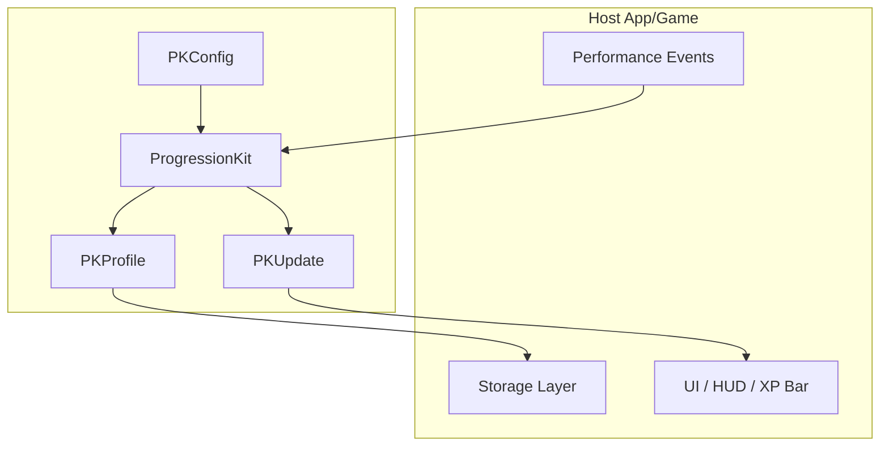

<p align="center">
  <a href="https://developer.apple.com/swift/"></a>
  <a href="https://developer.apple.com/xcode/"></a>
  <a href="https://developer.apple.com/documentation/xcode/swift-packages"></a>
  <a href="https://en.wikipedia.org/wiki/List_of_Apple_operating_systems"></a>
  <a href="https://thatfactory.github.io/progresskit/documentation/progressionkit/"></a>
  <a href="https://en.wikipedia.org/wiki/MIT_License"></a>
  <a href="https://github.com/thatfactory/progresskit/actions/workflows/ci.yml"></a>
  <a href="https://github.com/thatfactory/progresskit/actions/workflows/release.yml"></a>
</p>

# ProgressionKit
A reusable progression engine that turns player performance into configurable XP, levels, and unlocks across games and apps. 📈

`ProgressionKit` is a pure Swift package for apps and games that need deterministic progression logic without coupling progression rules to storage or UI frameworks.

It models:

- `XP` gain from successful performance.
- Player levels derived from total XP.
- Track-scoped mastery across distinct content.
- Tier unlocks such as `beginner`, `intermediate`, and `advanced`.

The package is deliberately content-agnostic. Host apps decide what a track, content item, and tier mean, then feed those identifiers into `ProgressionKit`.

## Implemented APIs

- `PKEngine`: applies a progression event to a profile and returns the updated profile plus derived progress values.
- `PKProfile`: persisted progression state for a player.
- `PKConfig`: tunable progression rules such as level size, XP reward, tier order, and unlock thresholds.
- `PKEvent`: a single outcome emitted by the host app.
- `PKUpdate`: the result of applying one event.

## Structure



## Integration

### Xcode
Use Xcode's [built-in support for SPM](https://developer.apple.com/documentation/xcode/adding_package_dependencies_to_your_app).

*or...*

### Package.swift
In your `Package.swift`, add `ProgressionKit` as a dependency:

```swift
dependencies: [
    .package(
        url: "https://github.com/thatfactory/progresskit",
        from: "0.1.0"
    )
]
```

Associate the dependency with your target:

```swift
targets: [
    .target(
        name: "YourTarget",
        dependencies: [
            .product(
                name: "ProgressionKit",
                package: "progresskit"
            )
        ]
    )
]
```

Run: `swift build`
